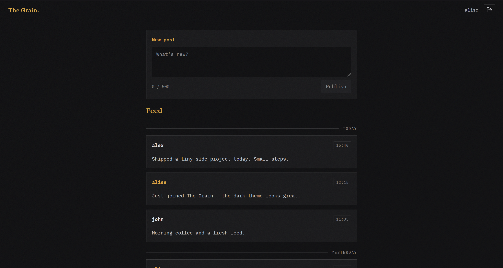
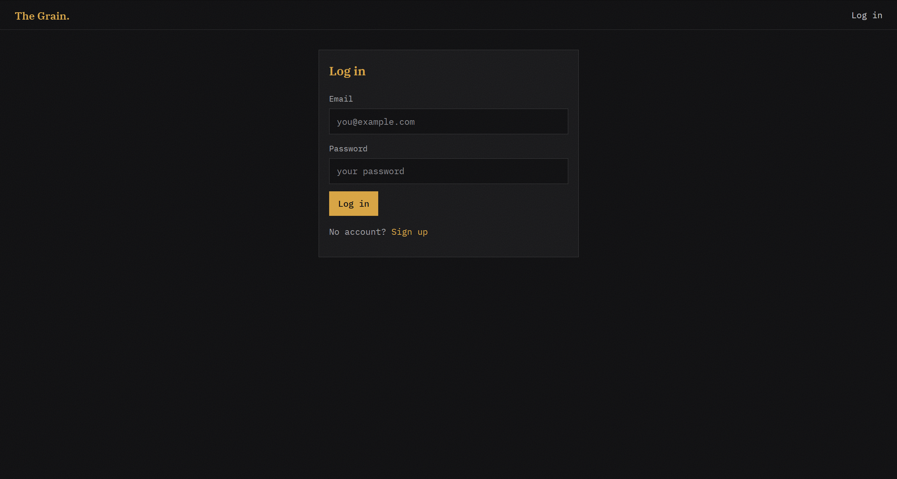
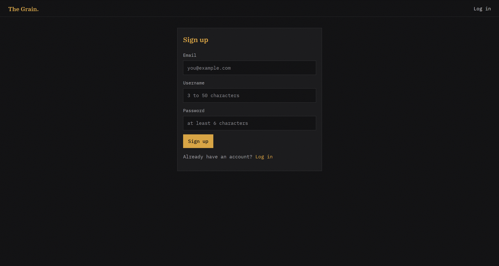

# The Grain

A tiny social network: sign up, write short posts, and read a public feed.


## Features

- Registration and login with JWT authentication
- Password hashing with `Bun.password`
- Creating short text posts (up to 500 characters)
- Public feed visible to everyone, even without an account
- Posts grouped by day (Today / Yesterday / date)
- Dark terminal-inspired design system with an amber accent

## Tech stack

| Layer    | Technology                                                       |
| -------- | ---------------------------------------------------------------- |
| Runtime  | [Bun](https://bun.sh)                                            |
| Backend  | [Elysia](https://elysiajs.com) + TypeScript                      |
| Database | PostgreSQL 16 (Docker) + [Drizzle ORM](https://orm.drizzle.team) |
| Auth     | JWT (`@elysiajs/jwt`), `Bun.password`                            |
| Frontend | Vue 3 + TypeScript + Vite + vue-router                           |

## Project structure

```
the-grain/
├── server/          # Elysia API: routes, middleware, database
├── client/          # Vue 3 single-page application
├── drizzle/         # Generated SQL migrations
├── docs/            # Screenshots and documentation assets
├── docker-compose.yml
└── drizzle.config.ts
```

## Getting started

### Prerequisites

- [Bun](https://bun.sh) 1.3+
- [Docker Desktop](https://www.docker.com/products/docker-desktop/) (must be running)

### 1. Install dependencies

```bash
bun install
```

### 4. Configure environment

Copy the example file and adjust values if needed:

```bash
cp .env.example .env
```

### 5. Start the database

```bash
docker compose up -d
```

### 6. Apply migrations

```bash
bunx drizzle-kit migrate
```

### 7. Start the API

```bash
bun --watch server/index.ts
```

The API is now available at http://localhost:3000 (check `GET /api/hello`).

### 8. Start the client

In a second terminal:

```bash
cd client
bun install
bun run dev
```

Open http://localhost:5173 — the app is running.

## API reference

| Method | Path                 | Auth | Description             |
| ------ | -------------------- | ---- | ----------------------- |
| GET    | `/api/hello`         | No   | Health check            |
| POST   | `/api/auth/register` | No   | Create an account       |
| POST   | `/api/auth/login`    | No   | Log in, returns a JWT   |
| GET    | `/api/auth/me`       | Yes  | Current user profile    |
| POST   | `/api/posts`         | Yes  | Create a post           |
| GET    | `/api/posts`         | No   | Public feed (latest 50) |

Authenticated requests use the header:

```
Authorization: Bearer <token>
```

## Development

| Command             | Description                       |
| ------------------- | --------------------------------- |
| `bun run dev`       | Start the API with hot reload     |
| `bun run lint`      | Lint the codebase with ESLint     |
| `bun run lint:fix`  | Lint and autofix                  |
| `bun run format`    | Format the codebase with Prettier |
| `bun run typecheck` | Type-check server and client      |

Git hooks run automatically on commit and push:

- **pre-commit** — lints staged files and runs the type check;
- **commit-msg** — enforces [Conventional Commits](https://www.conventionalcommits.org/);
- **pre-push** — validates the branch name (`feat/*`, `feature/*`, `fix/*`, `hotfix/*`, `docs/*`, `chore/*`, ...).

## Screenshots

commit:




## FAQ

**Which ports are used?**

- `3000` — API, `5173` — client (Vite), `5433` — PostgreSQL (host machine).

**How do I reset the database?**

```bash
docker compose down -v
docker compose up -d
bunx drizzle-kit migrate
```

**Where is the JWT stored?**

In `localStorage`. This keeps the client simple; for a production app consider httpOnly cookies.

**How do I change the accent color?**

Edit the `--accent` variable in `client/src/style.css`.

## License

GNU General Public License v3.0 — see [LICENSE](LICENSE).

## Authors

- Yuri Barinov
